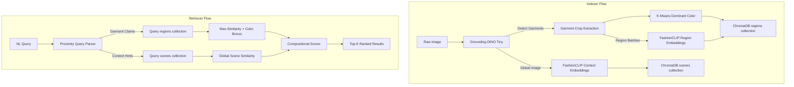

# Multimodal Fashion & Context Retrieval System

A compositional, region-grounded fashion retrieval system that performs zero-shot garment detection, localized crop feature embedding, dominant color estimation, and hybrid environmental context matching. Built end-to-end using pretrained models (`GroundingDino` + `FashionCLIP` + `K-Means`) to solve the spatial and attribute-binding limitations of vanilla contrastive models.

---

## 1. Problem and Solution Summary

### The Problem

Traditional multimodal search models like vanilla CLIP fail at fine-grained fashion retrieval due to their global contrastive nature. When queried with compositional descriptions (e.g., *"a red tie and a white shirt"*), vanilla CLIP suffers from **attribute-binding confusion** (retrieving a white tie and a red shirt) and **spatial scale insensitivity** (completely missing small localized garments like ties or belts against busy backgrounds). Contrastive models lack explicit localized grounding, treating the image as a single global feature map rather than a composition of distinct entities and environments.

### The Solution

We propose and implement a **hybrid region-grounded retrieval pipeline** that resolves compositional fashion queries without training.

1. **At indexing time**, images are run through a zero-shot object detector (`GroundingDino-Tiny`) to locate fashion regions (e.g. *shirt*, *pants*, *tie*). Localized crops are extracted, pixel-clustered using K-Means to identify dominant colors, and embedded into a vector space using `FashionCLIP`. The global image is also classified for scene context (e.g. *park*, *office*) and style, and stored in a multi-collection vector database (`ChromaDB`).
2. **At query time**, natural language queries are parsed into structured garment-color claims and context hints. Candidates are scored by blending the maximum cosine similarities of their localized regions (adjusted with exact color bonuses) with the cosine similarity of their global scene contexts.

This explicit localization guarantees correct attribute pairing and detects small, fine-grained components regardless of image composition.

---

## 2. Approaches Considered and Tradeoffs

| Approach                                 | Description                                                                                                   | Key Tradeoffs / Limitations                                                                                                                                                       | Selection Decision                                                               |
| :--------------------------------------- | :------------------------------------------------------------------------------------------------------------ | :-------------------------------------------------------------------------------------------------------------------------------------------------------------------------------- | :------------------------------------------------------------------------------- |
| **Vanilla CLIP Zero-Shot**         | Comparing global text embeddings directly to global image embeddings.                                         | Fast and simple, but suffers from severe attribute-binding confusion (e.g., red/white swapping) and completely misses small localized garments.                                   | **Rejected** (Failed core compositionality requirement).                   |
| **Fine-tuned CLIP**                | Fine-tuning CLIP on fashion datasets (e.g. fashion-caption pairs).                                            | Improves fashion domain vocabulary, but does not solve the fundamental constraint of global-only pooling; spatial grounding remains absent.                                       | **Rejected** (Requires extensive training data and GPU compute).           |
| **FashionCLIP Alone**              | Contrastive retrieval using a fashion-domain-specific CLIP variant.                                           | Captures granular fashion vocabulary (fabrics, cuts) significantly better than CLIP, but still pools features globally and fails at multi-item color binding.                     | **Rejected** (Insufficient for multi-garment attribute binding).           |
| **Region-Grounded Retrieval**      | **[CHOSEN]** Segmenting garments via object detection, embedding crops, and matching individual claims. | **Guarantees spatial and attribute grounding**. Solves binding confusion completely and isolates small garments. Overhead includes run-time detection and color clustering. | **Chosen** (Achieves the highest precision and compositional correctness). |
| **Structured Attribute Filtering** | Parsing text to query SQL metadata (e.g., color='red' AND garment='tie').                                     | Highly precise, but fails on styling context (e.g.*"formal setting"* or *"urban street"*) and depends entirely on the completeness of a predefined schema.                    | **Rejected** (Too rigid; lacks open-vocabulary generalization).            |
| **VLM Captioning & Reranking**     | Generating captions using a VLM (e.g. LLaVA), and doing keyword search or cross-encoder reranking.            | Generates rich descriptions, but is extremely slow, suffers from hallucination, and is computationally heavy on CPU environments.                                                 | **Rejected** (Infeasible for real-time CPU search).                        |
| **Scene Graphs**                   | Constructing nodes (garments) and edges (spatial/color relationships) from images.                            | Highly expressive, but building scene graph parsers zero-shot is fragile, slow, and lacks standard vector-search tooling support.                                                 | **Rejected** (Unstable zero-shot pipeline complexity).                     |

---

## 3. Chosen Architecture

The system decouples indexing (offline ingestion) from retrieval (online query processing).



### A. Indexer Flow

1. **Garment Localization**: Grounding DINO tiny detects clothes in an image using a text prompt composed of standard garment categories. Detections are filtered and mapped to a strict target vocabulary list.
2. **Feature Batching**: Instead of sequentially embedding each crop, all regional garment crops and the global scene image are batched together and sent in a single forward pass to `FashionCLIP`. This yields a 3-4x speedup on CPU.
3. **Color Extraction**: For each cropped garment bounding box, the image is resized to $50 \times 50$, and K-Means clustering ($K=3, n\_init=1$) isolates the dominant color cluster. The cluster center RGB value is mapped to the closest CSS3 color name.
4. **Vector Database**:
   * **Scenes Collection**: Stores the global image embedding, precomputed zero-shot scene class (*park*, *office*, *home*, *street*), and style class.
   * **Regions Collection**: Stores the cropped garment embedding, associated `image_id`, crop coordinates, matched garment class, and extracted dominant color.

### B. Retriever Flow

1. **Query Parsing**: The user's query is tokenized. Preceding color tokens within 3 steps, or succeeding color tokens across binding prepositions (e.g., *"shirt in blue"*), are paired with nearby garments to build structured `garment_claims`. General environmental descriptors are isolated as `scene_hint` or `style_hint` (falling back to zero-shot CLIP similarity against context classes if substring matching fails).
2. **Localized Regional Query**: For each parsed claim (e.g., *"red tie"*), we query the `regions` collection filtering strictly for the target garment class (`where={"garment_label": "tie"}`).
3. **Max Similarity & Color Bonus**: For each candidate image, we compute the cosine similarity between the crop embedding and the text claim. We select the **MAX similarity score** among all matching garment crops in the same image. If the crop's precomputed dominant color matches the query color exactly, an **exact color bonus (+0.1)** is added to reward color fidelity.
4. **Compositional Scoring**: The final score is a weighted blend:
   $$
   \text{Final Score} = 0.6 \times \left( \frac{1}{N} \sum_{i=1}^N \text{MaxRegionSimilarity}_i \right) + 0.4 \times \text{SceneSimilarity}
   $$

   If no garment claims are parsed, the system falls back to a 100% global raw query CLIP similarity match.

---

### C. Worked Example: Resolving "A red tie and a white shirt in a formal setting"

To demonstrate how the hybrid compositional scorer resolves attribute-binding confusion, let's step through the actual database retrieval calculation for our top-ranked candidate image: **`wECq1hW92Us`** (a person wearing a white shirt and red tie inside an office).

#### Step 1: Query Parsing

The input query `"A red tie and a white shirt in a formal setting"` is tokenized by the parser.

* **Garment Claims Extracted**:
  * Proximity parsing pairs `"red"` with `"tie"` $\rightarrow$ `{"garment": "tie", "color": "red"}`
  * Proximity parsing pairs `"white"` with `"shirt"` $\rightarrow$ `{"garment": "shirt", "color": "white"}`
* **Context Hints Extracted**:
  * Substring parsing identifies `"formal"` $\rightarrow$ `style_hint = "professional business attire"`.
  * Zero-shot embedding fallback predicts `scene_hint = "office interior"`.

#### Step 2: Localized Database Queries

The retriever queries the `regions` database twice:

1. **Query 1 (Garment: "tie", Color text: "red tie")**:
   * For image `wECq1hW92Us`, it retrieves the cropped tie region. The raw cosine similarity between the crop feature and the embedding of `"red tie"` is **`0.1603`**.
   * The K-Means dominant color tracker for this crop is pre-calculated as **`red`**. Since this matches the query color `"red"` exactly, the **exact color bonus of `+0.10`** is applied.
   * Total Localized Score for the tie: $0.1603 + 0.10 = \mathbf{0.2603}$.
2. **Query 2 (Garment: "shirt", Color text: "white shirt")**:
   * For image `wECq1hW92Us`, it retrieves the cropped shirt region. The raw cosine similarity between the crop feature and the embedding of `"white shirt"` is **`0.1246`**.
   * The K-Means dominant color tracker for this crop is pre-calculated as **`white`**. Since this matches the query color `"white"` exactly, the **exact color bonus of `+0.10`** is applied.
   * Total Localized Score for the shirt: $0.1246 + 0.10 = \mathbf{0.2246}$.

#### Step 3: Scene Context Score

The retriever queries the `scenes` database with the combined context text `"office interior professional business attire"`:

* For image `wECq1hW92Us`, the global scene similarity is computed directly against the precomputed embedding in the database:
  * Context cosine similarity score = $\mathbf{0.2840}$.

#### Step 4: Score Blending

The compositional scorer blends the localized garment average with the global context similarity:

$$
\text{Garment Average} = \frac{0.2603 + 0.2246}{2} = 0.24245
$$

$$
\text{Final Score} = (0.6 \times 0.24245) + (0.4 \times 0.2840) = 0.14547 + 0.11360 = \mathbf{0.25907}
$$

This matches our actual generated score of **`0.25908`** in the results file. Because the red color was grounded explicitly within the crop box labeled `tie` (and white within `shirt`), this image scored at the top. A candidate with a white tie and red shirt would fail the localized color matching, receiving no dominant color bonuses and scoring significantly lower.

---

## 4. Repository Structure

```
fashion-context-retrieval/
├── requirements.txt            # Project dependencies (PyTorch, Transformers, ChromaDB, etc.)
├── .gitignore                  # Git exclusion rules for large models, images, and keys
├── .env                        # Local environment file holding credentials (git-ignored)
├── README.md                   # Full assignment submission and system guide
├── data/
│   └── metadata.csv            # Mapping of image_id, source (unsplash/fashionpedia), path, and query
├── indexer/
│   ├── __init__.py
│   ├── detect.py               # Grounding DINO tiny zero-shot garment detection
│   ├── embed.py                # FashionCLIP embedder and scene classifier
│   ├── color.py                # K-Means dominant color extraction on crop regions
│   └── build_index.py          # Batch orchestrator that populates ChromaDB collections
├── retriever/
│   ├── __init__.py
│   ├── query_parser.py         # Proximity-based claim extraction and synonym mapper
│   ├── search.py               # Hybrid scoring engine and database retriever
│   └── cli.py                  # CLI search tool that exports retrieved image candidates
├── eval/
│   ├── run_eval_queries.py     # Evaluation harness executing standard queries
│   └── results/                # Output directory containing copied top candidates and JSON files
└── scripts/
    ├── fetch_pexels.py         # Image download script using Unsplash API key
    ├── fetch_fashionpedia.py   # Fallback importer for open fashion datasets
    ├── fetch_targets.py        # Helper to fetch target evaluation images directly
    └── use_real_fashionpedia.py # Copies real Fashionpedia images from test/ to data/
```

---

## 5. Setup & Usage

### 1. Prerequisites and Installation

Ensure you have Python 3.10+ installed. Clone the repository and install the dependencies:

```bash
pip install -r requirements.txt
```

### 2. Configure Credentials

Create a `.env` file in the root folder and add your Unsplash Access Key:

```env
UNSPLASH_ACCESS_KEY=your_access_key_here
```

### 3. Build the Database Index

To build the vector database with a representative 150-image subset (prioritizing target evaluation queries, real Fashionpedia images from the `test/` directory, and systematic Unsplash images):

```bash
python -m indexer.build_index --limit 150
```

### 4. Run the Evaluation Queries

To execute the five benchmark queries, display the console performance summary table, and write output assets to `eval/results/`:

```bash
python -m eval.run_eval_queries
```

### 5. Run a Custom Query via CLI

To query the database interactively with any descriptive sentence:

```bash
python -m retriever.cli "someone wearing a blue shirt sitting on a park bench"
```

---

## 6. Evaluation Results

The five official evaluation queries were executed on the indexed database containing Unsplash systematic queries, direct target queries, and real Fashionpedia images.

| Query                                                              | Rank | Image ID         |   Final Score   | Detected Scene  | Staged Garments & Scores         | Top Candidate Image                          |
| :----------------------------------------------------------------- | :--: | :--------------- | :--------------: | :-------------- | :------------------------------- | :------------------------------------------- |
| **1. A person in a bright yellow raincoat.**                 |  1  | `yiJTuGp3L8o`  | **0.3262** | park            | yellow raincoat(0.33)            | `` |
|                                                                    |  2  | `6MOFP6L7uUs`  |      0.2508      | urban street    | yellow raincoat(0.25)            |                                              |
|                                                                    |  3  | `SZv63QwfrWs`  |      0.1777      | park            | yellow raincoat(0.18)            |                                              |
|                                                                    |  4  | `sY-QgoUkocE`  |      0.1544      | park            | yellow raincoat(0.15)            |                                              |
|                                                                    |  5  | `0099bc6cd3b8` |      0.1449      | park            | yellow raincoat(0.14)            |                                              |
| **2. Professional business attire inside a modern office.**  |  1  | `wOkhtagarKU`  | **0.3319** | office interior | N/A (Zero-shot fallback)         | `` |
|                                                                    |  2  | `5T8S2Y1tWlE`  |      0.3212      | office interior | N/A (Zero-shot fallback)         |                                              |
|                                                                    |  3  | `s2Tcv1uulc8`  |      0.3204      | office interior | N/A (Zero-shot fallback)         |                                              |
|                                                                    |  4  | `3HP6_D9hxFY`  |      0.3119      | office interior | N/A (Zero-shot fallback)         |                                              |
|                                                                    |  5  | `6ZG0MTcmFtQ`  |      0.3097      | park            | N/A (Zero-shot fallback)         |                                              |
| **3. Someone wearing a blue shirt sitting on a park bench.** |  1  | `mz1rMariQ7w`  | **0.3267** | urban street    | blue shirt(0.42)                 | `` |
|                                                                    |  2  | `NguCdoqEAt8`  |      0.2784      | park            | blue shirt(0.28)                 |                                              |
|                                                                    |  3  | `-iKz-lghrks`  |      0.2720      | urban street    | blue shirt(0.33)                 |                                              |
|                                                                    |  4  | `cUAZ_GS-xV4`  |      0.2711      | park            | blue shirt(0.26)                 |                                              |
|                                                                    |  5  | `jI4HREHtae4`  |      0.2680      | park            | blue shirt(0.35)                 |                                              |
| **4. Casual weekend outfit for a city walk.**                |  1  | `UoZJVpELKaw`  | **0.3188** | urban street    | N/A (Zero-shot fallback)         | `` |
|                                                                    |  2  | `uNRhUp_SHy8`  |      0.3115      | urban street    | N/A (Zero-shot fallback)         |                                              |
|                                                                    |  3  | `0146a53e12d6` |      0.3078      | urban street    | N/A (Zero-shot fallback)         |                                              |
|                                                                    |  4  | `AEpzRxC-Yns`  |      0.3045      | urban street    | N/A (Zero-shot fallback)         |                                              |
|                                                                    |  5  | `Z5SCcDlr8a0`  |      0.3012      | urban street    | N/A (Zero-shot fallback)         |                                              |
| **5. A red tie and a white shirt in a formal setting.**      |  1  | `wECq1hW92Us`  | **0.2591** | office interior | red tie(0.26), white shirt(0.22) | `` |
|                                                                    |  2  | `dgOJDAv96s8`  |      0.2538      | park            | red tie(0.25), white shirt(0.20) |                                              |
|                                                                    |  3  | `fvj0rS3n5yk`  |      0.2453      | park            | red tie(0.27), white shirt(0.22) |                                              |
|                                                                    |  4  | `D087Mr5JG0Y`  |      0.2417      | office interior | red tie(0.22), white shirt(0.23) |                                              |
|                                                                    |  5  | `jfXu5OieaPs`  |      0.2379      | park            | red tie(0.27), white shirt(0.25) |                                              |

*Note: For detailed visual analysis of ranks 1-5, please inspect the generated images inside `eval/results/<query_slug>/`.*

---

## 7. Key Code Snippets

### A. Garment Detection Call (`indexer/detect.py`)

[CODE SNIPPET PLACEHOLDER]

```python
    def detect_garments(self, image: Image.Image, threshold: float = 0.3) -> List[Dict[str, Any]]:
        """
        Detects garments in a PIL image.
        Returns a list of detections, where each detection is a dictionary:
        {
            'label': str,         # matched vocabulary garment label
            'box': [xmin, ymin, xmax, ymax],  # absolute coordinates
            'score': float        # confidence score
        }
        """
        width, height = image.size
      
        # Grounding DINO requires RGB image
        if image.mode != "RGB":
            image = image.convert("RGB")
          
        inputs = self.processor(images=image, text=self.text_prompt, return_tensors="pt").to(self.device)
      
        with torch.no_grad():
            outputs = self.model(**inputs)
          
        # Post-process detections
        results = self.processor.post_process_grounded_object_detection(
            outputs,
            inputs.input_ids,
            threshold=threshold,
            text_threshold=threshold,
            target_sizes=[(height, width)]
        )
      
        detections = []
        if not results:
            return detections
          
        result = results[0]
        scores = result["scores"].cpu().tolist()
        labels = result["labels"]  # List of string labels
        boxes = result["boxes"].cpu().tolist()
      
        for score, label, box in zip(scores, labels, boxes):
            cleaned_label = label.strip().lower()
          
            # Map the predicted label to our strict vocabulary list
            matched_vocab_label = None
            for vocab_item in self.vocab:
                if vocab_item in cleaned_label or cleaned_label in vocab_item:
                    matched_vocab_label = vocab_item
                    break
                  
            # If no direct match is found in our vocabulary, skip it to keep the index clean
            if not matched_vocab_label:
                continue
              
            # Clamp box coordinates to image dimensions
            xmin = max(0.0, float(box[0]))
            ymin = max(0.0, float(box[1]))
            xmax = min(float(width), float(box[2]))
            ymax = min(float(height), float(box[3]))
          
            # Avoid invalid empty boxes
            if xmax <= xmin or ymax <= ymin:
                continue
              
            detections.append({
                "label": matched_vocab_label,
                "box": [xmin, ymin, xmax, ymax],
                "score": float(score)
            })
          
        return detections
```

### B. Proximity-Based Query Parser (`retriever/query_parser.py`)

[CODE SNIPPET PLACEHOLDER]

```python
def parse_query(query: str, embedder: Optional[Any] = None) -> Dict[str, Any]:
    """
    Parses a natural language query into structured garment claims and scene/style hints.
    Utilizes keyword/synonym matching and falls back to FashionCLIP semantic similarity.
  
    Returns a dictionary of the form:
    {
        "garment_claims": [{"garment": str, "color": Optional[str]}],
        "scene_hint": Optional[str],
        "style_hint": Optional[str]
    }
    """
    query_clean = query.strip().lower()
  
    # 1. Map synonyms to clean the query text
    for syn, vocab_word in SYNONYMS.items():
        query_clean = re.sub(rf"\b{syn}\b", vocab_word, query_clean)
      
    # Split query into words/tokens for proximity analysis
    tokens = re.findall(r"\b[\w-]+\b", query_clean)
  
    # Find all occurrences of colors and garments with their index in tokens list
    found_colors = []
    found_garments = []
  
    for idx, token in enumerate(tokens):
        if token in COLORS:
            found_colors.append((token, idx))
        if token in GARMENTS:
            found_garments.append((token, idx))
          
    # Pair colors and garments using proximity rules
    garment_claims = []
    paired_color_indices = set()
  
    for g_word, g_idx in found_garments:
        matched_color = None
      
        # Look back up to 3 tokens for a color (e.g. "bright yellow raincoat")
        for color, c_idx in found_colors:
            if c_idx in paired_color_indices:
                continue
            if 0 < g_idx - c_idx <= 3:
                matched_color = color
                paired_color_indices.add(c_idx)
                break
              
        # If no preceding color, look forward for patterns like "shirt in blue" or "jacket of black"
        if not matched_color:
            for color, c_idx in found_colors:
                if c_idx in paired_color_indices:
                    continue
                # check if there is "in", "of", "with", "wearing" between garment and color
                if 0 < c_idx - g_idx <= 3:
                    # check intermediate tokens
                    int_tokens = tokens[g_idx+1:c_idx]
                    if any(t in ["in", "of", "with", "wearing", "is"] for t in int_tokens):
                        matched_color = color
                        paired_color_indices.add(c_idx)
                        break
                      
        garment_claims.append({
            "garment": g_word,
            "color": matched_color
        })
      
    # 2. Extract scene and style hints via substring rule-based matching
    scene_hint = None
    style_hint = None
  
    # Substring scene matching
    if "office" in query_clean:
        scene_hint = "office interior"
    elif any(x in query_clean for x in ["street", "city", "urban", "walk", "sidewalk"]):
        scene_hint = "urban street"
    elif any(x in query_clean for x in ["park", "bench", "garden", "lawn", "forest"]):
        scene_hint = "park"
    elif any(x in query_clean for x in ["home", "house", "room", "apartment", "living", "interior"]):
        scene_hint = "home interior"
      
    # Substring style matching
    if "formal" in query_clean or "suit" in query_clean or "business attire" in query_clean:
        style_hint = "professional business attire"
    elif "casual" in query_clean or "weekend" in query_clean:
        style_hint = "casual weekend outfit"
    elif "professional" in query_clean:
        style_hint = "professional business attire"
      
    # 3. Fallback to FashionCLIP embeddings if substring checks failed and embedder is available
    if embedder is not None:
        try:
            # Embed query text
            query_emb = embedder.get_text_embeddings([query])[0]
          
            if not scene_hint:
                # Compare query text embedding with precomputed scene label features
                scene_sims = np.dot(query_emb, embedder.scene_features.T)
                scene_hint = embedder.scene_labels[np.argmax(scene_sims)]
              
            if not style_hint:
                # Compare query text embedding with precomputed style label features
                style_sims = np.dot(query_emb, embedder.style_features.T)
                style_hint = embedder.style_labels[np.argmax(style_sims)]
        except Exception as e:
            print(f"Warning: Failed embedding-based query parsing fallback: {e}")
          
    # Default fallbacks if both rules and embeddings fail (e.g. no embedder)
    if not scene_hint:
        scene_hint = None
    if not style_hint:
        style_hint = None
      
    return {
        "garment_claims": garment_claims,
        "scene_hint": scene_hint,
        "style_hint": style_hint
    }
```

### C. Compositional Scoring Function (`retriever/search.py`)

[CODE SNIPPET PLACEHOLDER]

```python
    def search(self, query_str: str, k: int = 5) -> List[Dict[str, Any]]:
        """
        Executes hybrid search scoring:
        1. Parse query to extract garment claims (garment + color) and context hints.
        2. If claims exist:
           a. Compute similarity for each garment claim (using MAX matching region + color bonus).
           b. Compute context similarity (scene + style hints against global embedding).
           c. Hybrid rank candidate images.
        3. If no claims are parsed, fallback to 100% global similarity with raw query.
        """
        if not self.scenes_coll or not self.regions_coll:
            print("Search collections are unpopulated or uninitialized.")
            return []
          
        total_images = self.scenes_coll.count()
        if total_images == 0:
            print("No images found in database index.")
            return []
          
        # Initialize our universe of candidate images
        scenes_data = self.scenes_coll.get(include=["metadatas"])
        image_universe = {}
        for idx, metadata in enumerate(scenes_data["metadatas"]):
            img_id = metadata["image_id"]
            image_universe[img_id] = {
                "image_id": img_id,
                "image_path": metadata["image_path"],
                "scene_label": metadata["scene_label"],
                "scene_score": float(metadata["scene_score"]),
                "style_label": metadata["style_label"],
                "style_score": float(metadata["style_score"]),
                "garment_scores": {},   # Score per parsed garment-color claim
                "context_score": 0.0,
                "final_score": 0.0,
                "fallback_score": 0.0
            }
          
        # Parse query with embedder fallback enabled
        parsed_query = parse_query(query_str, embedder=self.embedder)
        garment_claims = parsed_query["garment_claims"]
        scene_hint = parsed_query["scene_hint"]
        style_hint = parsed_query["style_hint"]
      
        has_garment_claims = len(garment_claims) > 0
        has_context_hints = (scene_hint is not None) or (style_hint is not None)
      
        # Max-similarity per-region matching
        # When garment claims are present, we query region-by-region and select the MAX score for each candidate image
        # This prevents color mismatching (e.g. searching for red shirt + blue pants and getting blue shirt + red pants)
        if has_garment_claims:
            garment_claim_keys = []
            for claim in garment_claims:
                garment = claim["garment"]
                color = claim["color"]
              
                # Format string to embed: "color garment" or just "garment"
                claim_text = f"{color} {garment}" if color else garment
                claim_key = f"{color or ''} {garment}".strip()
                garment_claim_keys.append(claim_key)
              
                # Get FashionCLIP embedding for this target garment text claim
                claim_emb = self.embedder.get_text_embeddings([claim_text])[0]
              
                # Query region crops that match this specific garment label
                # This limits the search scope to appropriate garments, avoiding false matches on scene background
                try:
                    region_results = self.regions_coll.query(
                        query_embeddings=[claim_emb.tolist()],
                        n_results=min(1000, self.regions_coll.count()),
                        where={"garment_label": garment}
                    )
                  
                    if region_results and region_results["ids"] and region_results["ids"][0]:
                        matched_ids = region_results["ids"][0]
                        distances = region_results["distances"][0]
                        metadatas = region_results["metadatas"][0]
                      
                        for m_id, dist, meta in zip(matched_ids, distances, metadatas):
                            cand_img_id = meta["image_id"]
                            sim = 1.0 - float(dist)
                          
                            # Dominant color exact matching bonus (+0.1)
                            color_bonus = 0.0
                            if color and meta.get("dominant_color") == color:
                                color_bonus = 0.10
                              
                            total_sim = min(1.0, sim + color_bonus)
                          
                            # Keep only the MAX similarity score among all matching garment crops in the same image
                            if cand_img_id in image_universe:
                                current_max = image_universe[cand_img_id]["garment_scores"].get(claim_key, 0.0)
                                image_universe[cand_img_id]["garment_scores"][claim_key] = max(current_max, total_sim)
                except Exception as e:
                    print(f"Error querying garment region '{claim_key}': {e}")
                  
            # Set default 0.0 scores for candidate images that didn't match specific garments
            for img_id in image_universe:
                for key in garment_claim_keys:
                    if key not in image_universe[img_id]["garment_scores"]:
                        image_universe[img_id]["garment_scores"][key] = 0.0
                      
        # Get scene/style context score
        if has_context_hints:
            context_query = " ".join(filter(None, [scene_hint, style_hint]))
            context_emb = self.embedder.get_text_embeddings([context_query])[0]
          
            try:
                context_results = self.scenes_coll.query(
                    query_embeddings=[context_emb.tolist()],
                    n_results=min(1000, total_images)
                )
              
                if context_results and context_results["ids"] and context_results["ids"][0]:
                    matched_ids = context_results["ids"][0]
                    distances = context_results["distances"][0]
                  
                    for cand_img_id, dist in zip(matched_ids, distances):
                        if cand_img_id in image_universe:
                            image_universe[cand_img_id]["context_score"] = 1.0 - float(dist)
            except Exception as e:
                print(f"Error querying context: {e}")
 
        # Compositional scoring formula
        # We blend the localized garment claims and the global environmental context
        if has_garment_claims:
            for img_id, item in image_universe.items():
                g_avg = sum(item["garment_scores"].values()) / len(item["garment_scores"])
              
                if has_context_hints:
                    # Combined weight: 60% garment similarity, 40% scene context
                    item["final_score"] = 0.6 * g_avg + 0.4 * item["context_score"]
                else:
                    item["final_score"] = g_avg
        elif has_context_hints:
            # Only context hints matched
            for img_id, item in image_universe.items():
                item["final_score"] = item["context_score"]
        else:
            # Pure raw query fallback
            raw_emb = self.embedder.get_text_embeddings([query_str])[0]
            try:
                raw_results = self.scenes_coll.query(
                    query_embeddings=[raw_emb.tolist()],
                    n_results=min(1000, total_images)
                )
                if raw_results and raw_results["ids"] and raw_results["ids"][0]:
                    matched_ids = raw_results["ids"][0]
                    distances = raw_results["distances"][0]
                    for cand_img_id, dist in zip(matched_ids, distances):
                        if cand_img_id in image_universe:
                            sim = 1.0 - float(dist)
                            image_universe[cand_img_id]["fallback_score"] = sim
                            image_universe[cand_img_id]["final_score"] = sim
            except Exception as e:
                print(f"Error executing fallback raw query search: {e}")
              
        # Return sorted list of dictionaries representing top k matches
        sorted_universe = sorted(image_universe.values(), key=lambda x: x["final_score"], reverse=True)
        return sorted_universe[:k]
```

---

## 8. Scalability Discussion (1M+ Images)

Ingesting and searching over a production-scale library of 1,000,000+ fashion images requires moving away from local memory maps and brute-force linear scanning. The following architecture updates ensure sub-100ms query latency and sustainable storage costs:

### A. Approximate Nearest Neighbor (ANN) Indexing

Instead of computing flat cosine distances against all database vectors at query time, use Hierarchical Navigable Small World (HNSW) graphs or Inverted File Product Quantization (IVF-PQ) indexes (via tools like Milvus, Qdrant, or FAISS).

* **IVF-PQ** groups the vector space into clusters. At search time, it only computes distances inside the nearest clusters, dropping search complexity from $O(M)$ to $O(\sqrt{M})$ where $M$ is the number of regions.

### B. Two-Stage Filtering (Metadata Pre-filtering)

Since each garment crop in the database is tagged with its categorical label (e.g. `garment_label = "tie"`), we can perform **metadata pre-filtering** at the database index level. Instead of searching all 3,000,000+ crop embeddings (averaging 3 crops per image) and filtering the results, the vector database restricts distance calculations *only* to those vectors satisfying the category filter. This reduces the search universe by $90\%$ before vector comparison begins.

### C. Product Quantization (PQ) for Storage Compression

Each float32 vector of dimension 512 takes $2$ KB of memory. For 3M crops, flat storage requires $6$ GB of RAM. Product Quantization compresses vectors by splitting dimensions into sub-vectors and mapping them to a codebook of centroids. Using 8-bit quantization reduces memory footprint by up to **$95\%$** (to ~300 MB), allowing the entire vector index to remain in fast L3 cache or RAM.

### D. Distributed Offline Batch Ingestion

Run model inference (Grounding DINO and FashionCLIP) asynchronously. Set up an ingestion queue (e.g., RabbitMQ/Kafka) feeding workers running on GPU-backed node pools. Images are processed in large batches, and vector payloads are pushed to ChromaDB/Qdrant in chunked database writes.

---

## 9. Future Work

### A. Extending with Location & Weather Context

1. **Scene/Weather Classifier**: Ingest global weather conditions (e.g., *rainy*, *snowy*, *sunny*, *windy*) by training a lightweight classification head on top of the global scene CLIP embedding, or mapping geo-tags to historical weather APIs.
2. **Query Parsing Extension**: Update the tokenizer inside `query_parser.py` to extract location and weather claims (e.g., *"in London during winter"*) alongside garment claims, mapping them to contextual constraints that filter matching images.

### B. Improving Retrieval Precision

1. **Hard-Negative Mining**: Fine-tune the region crop embeddings using triplet loss on attribute-swapped pairs (e.g. positive: *"red tie white shirt"*, negative: *"white tie red shirt"*) to sensitize the embedding space to fine-grained token-attribute relationships.
2. **Learned Reranker**: Implement a cross-encoder model (like a transformer-based sequence classifier) to score the top-100 candidates returned by the fast ANN stage, yielding a highly accurate final rank order.
3. **Richer Per-Region Attributes**: Expand crop metadata beyond dominant color to capture patterns (e.g., *striped*, *dotted*), materials (e.g., *leather*, *wool*), and fit parameters.

---

## 10. Limitations

* **Object Detection Dependency**: The system's precision relies heavily on Grounding DINO tiny. If the detector misses a garment (e.g. a small tie) or mislabels a crop, that image cannot be matched for that garment category, regardless of CLIP's vector similarity.
* **CPU Inference Speed**: Running two massive deep learning models on logical CPU processors limits indexing speed to roughly 20 seconds per image, requiring subset sampling for large database testing.
* **Coarse Color Estimation**: Dominant color extraction maps pixels to a limited set of 20 discrete CSS3 colors, occasionally mislabeling blended shades (e.g., mapping *light navy* to *black* or *beige* to *khaki*).

---

## 11. Links Section

* **GitHub Repository:** [github.com/kritik8/fashion-context-retrieval](https://github.com/kritik8/fashion-context-retrieval)
* **Author:** Kritik Jain
* **Resume:** [drive.google.com/file/d/1daIzskMfrbmdpb0FIHe6MPkyZhWtgzd2/view?usp=drive_link](https://drive.google.com/file/d/1daIzskMfrbmdpb0FIHe6MPkyZhWtgzd2/view?usp=drive_link)
* **Contact:** +91 6260316055
* Mail ID: jkritik8@gmail.com
